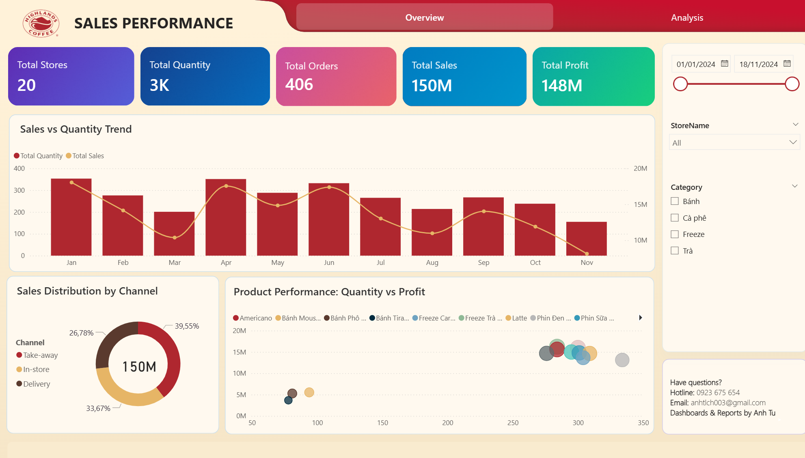
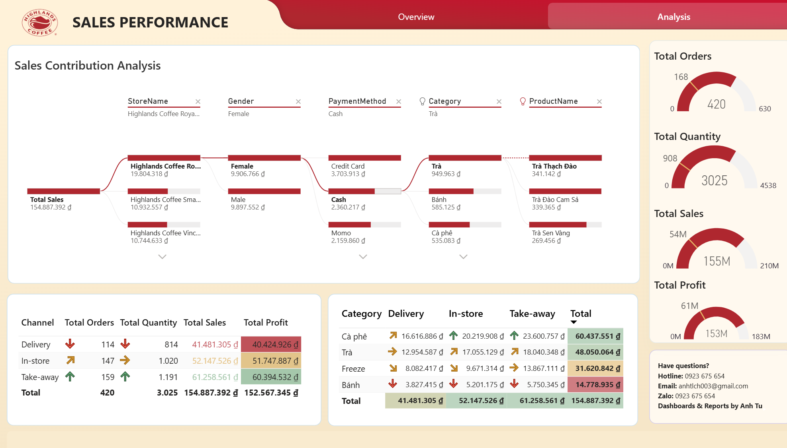
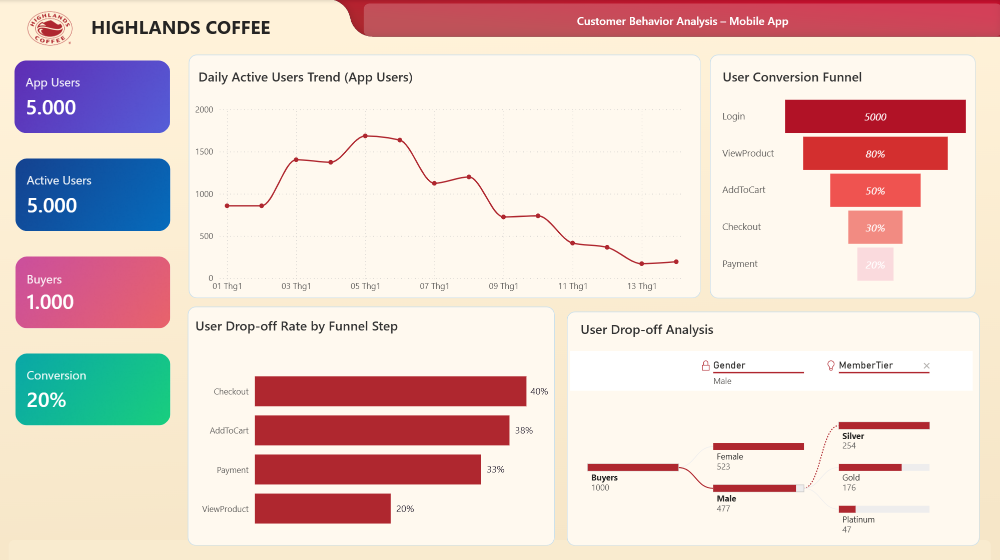

# ☕ Highlands Coffee — Business Process & Sales Analysis

<div align="center">


**Phân tích quy trình kinh doanh và hành vi khách hàng của chuỗi Highlands Coffee**  
*Banking Academy of Vietnam — Management Information System | 2025*

</div>

---

## 📌 Overview

Dự án phân tích toàn diện hoạt động kinh doanh của **Highlands Coffee** — chuỗi cà phê hàng đầu Việt Nam — thông qua bộ dữ liệu mô phỏng 400+ khách hàng và hệ thống giao dịch. Trọng tâm gồm phân tích RFM để phân khúc khách hàng và xây dựng 2 dashboard Power BI tương tác phục vụ ra quyết định kinh doanh.

---

## 📊 Dashboards

### Dashboard 1 — Sales Performance
> `final1.pbix` · 2 pages: Overview & Analysis

**Page 1 — Overview**



Các KPI chính:
- **Total Stores:** 20 · **Total Orders:** 406
- **Total Sales:** 150M đ · **Total Profit:** 148M đ · **Total Quantity:** 3K

Visualizations:
- Sales vs Quantity Trend theo tháng (Jan–Nov)
- Sales Distribution by Channel: Take-away (39.55%) · In-store (33.67%) · Delivery (26.78%)
- Product Performance: Quantity vs Profit scatter chart

**Page 2 — Analysis**



- Decomposition Tree: StoreName → Gender → PaymentMethod → Category → ProductName
- Channel × Category breakdown table (Delivery / In-store / Take-away)
- KPI gauges: Total Orders · Total Quantity · Total Sales · Total Profit

---

### Dashboard 2 — Customer Behavior Analysis (Mobile App)
> `final2.pbix` · 1 page



Phân tích hành vi người dùng trên ứng dụng Highlands Coffee:

| Metric | Value |
|---|---|
| App Users | 5,000 |
| Active Users | 5,000 |
| Buyers | 1,000 |
| **Conversion Rate** | **20%** |

**User Conversion Funnel:**
```
Login (5,000) → ViewProduct (80%) → AddToCart (50%) → Checkout (30%) → Payment (20%)
```

**Drop-off Analysis by Funnel Step:**
- Checkout: 40% drop-off
- AddToCart: 38% drop-off
- Payment: 33% drop-off
- ViewProduct: 20% drop-off

---

## 🎯 RFM Customer Segmentation

Phân tích RFM trên **400+ khách hàng** sử dụng Excel, phân loại thành 4 phân khúc:

| Phân khúc | Điều kiện | Đặc điểm | Chiến lược |
|---|---|---|---|
| 🏆 **VIP** | R≥4, F≥4, M≥3 | Mua thường xuyên, chi tiêu cao | Giữ chân, tạo gắn bó |
| 🌱 **Tiềm năng** | R≥4, F≤3, M≤3 | Mới mua, chưa mua nhiều | Tăng tần suất mua |
| 😴 **Ngủ đông** | R≤2, F≥3 | Từng mua nhiều nhưng lâu không quay lại | Chiến dịch tái kích hoạt |
| ❌ **Rủi ro** | R≤2, F≤2, M≤2 | Ít mua, không trung thành | Ưu đãi đặc biệt để giữ lại |

**RFM Scoring:**
- **R** (Recency): Số ngày kể từ lần mua cuối
- **F** (Frequency): Số lần mua trong kỳ phân tích
- **M** (Monetary): Tổng chi tiêu của khách hàng

---

## 🗂️ Project Structure

```
Highlands-Coffee-Analysis/
│
├── 📊 final1.pbix                  # Sales Performance Dashboard (2 pages)
├── 📊 final2.pbix                  # Customer Behavior Analysis Dashboard
│
├── 📁 assets/
│   ├── sales-overview.png          # Screenshot Dashboard 1 - Page 1
│   ├── sales-analysis.png          # Screenshot Dashboard 1 - Page 2
│   └── customer-behavior.png       # Screenshot Dashboard 2
│
├── 📁 reports/
│   └── Nhom02_baocao.pdf           # Full project report (Vietnamese)
│
└── 📄 README.md
```

---

## 🔍 Key Insights

**Sales Performance:**
1. **In-store chiếm 33.67%** doanh thu — kênh quan trọng cần duy trì trải nghiệm tại cửa hàng
2. **Trà** là category bán chạy nhất theo doanh thu, **Cà phê** dẫn đầu về profit margin
3. Doanh thu có xu hướng giảm từ tháng 8 trở đi — cần chiến dịch kích cầu cuối năm

**Customer Behavior (App):**
1. **Conversion rate chỉ 20%** — 80% người dùng không hoàn thành purchase
2. **Checkout drop-off cao nhất (40%)** — bottleneck cần cải thiện UX/UI
3. **Silver tier** chiếm phần lớn buyers — tiềm năng upsell lên Gold/Platinum

**RFM:**
1. Nhóm **VIP** cần chương trình loyalty riêng để duy trì doanh thu ổn định
2. Nhóm **Tiềm năng** là cơ hội tăng trưởng lớn nhất — cần nurturing campaign

---

## 🛠️ Tech Stack

| Tool | Usage |
|---|---|
| **Power BI Desktop** | Data modeling, DAX measures, interactive dashboards |
| **DAX** | Custom measures: Conversion Rate, Drop-off Rate, RFM scores |
| **Excel** | RFM scoring, data preprocessing |
| **Power Query** | Data transformation & cleaning |

---

## 📁 Data Sources

Bộ dữ liệu mô phỏng gồm:
- `Customers` — Thông tin 400+ khách hàng (ID, tên, tier, gender)
- `Orders` — Dữ liệu đơn hàng (date, channel, store, payment method)
- `Order_Details` — Chi tiết sản phẩm (category, quantity, price)
- `Products` — Danh mục sản phẩm Highlands Coffee
- `Stores` — Thông tin 20 cửa hàng
- `Employees` — Dữ liệu nhân viên
- `Departments` — Cơ cấu phòng ban

---

## 🏫 About

| | |
|---|---|
| **Course** | Management Information System (Hệ thống Thông tin Quản lý) |
| **Institution** | Banking Academy of Vietnam |
| **Instructor** | TS. Bùi Thị Hồng Nhung |
| **Team** | Nhóm 2 — 6 members |
| **Period** | 10/2025 – 12/2025 |
| **Grade** | A |
