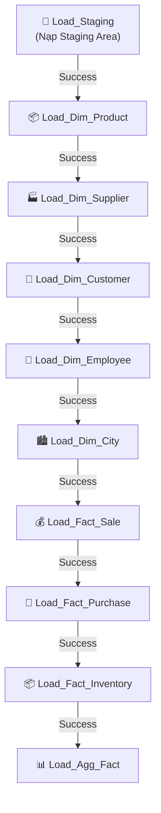
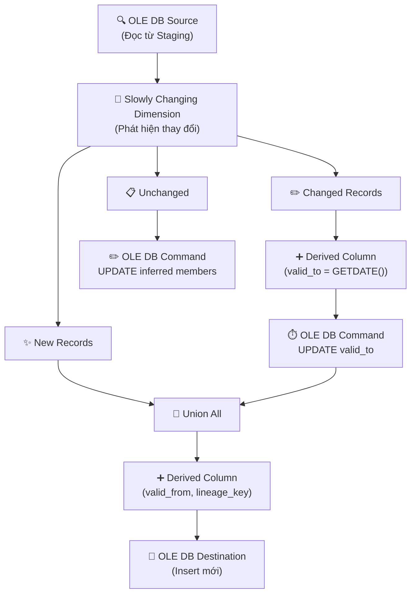
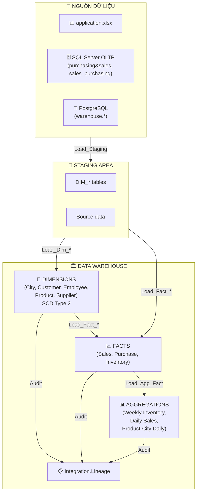
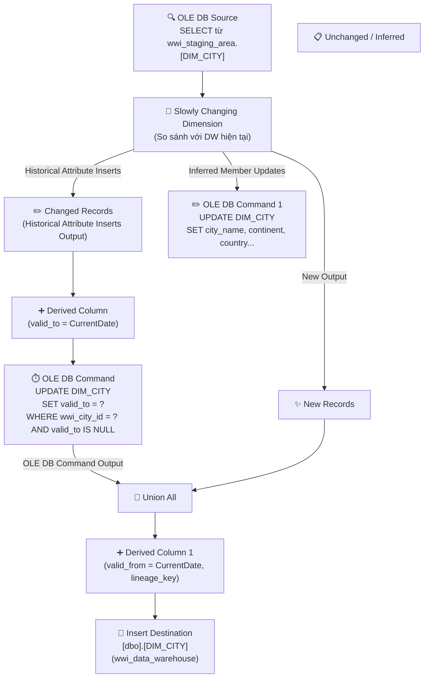
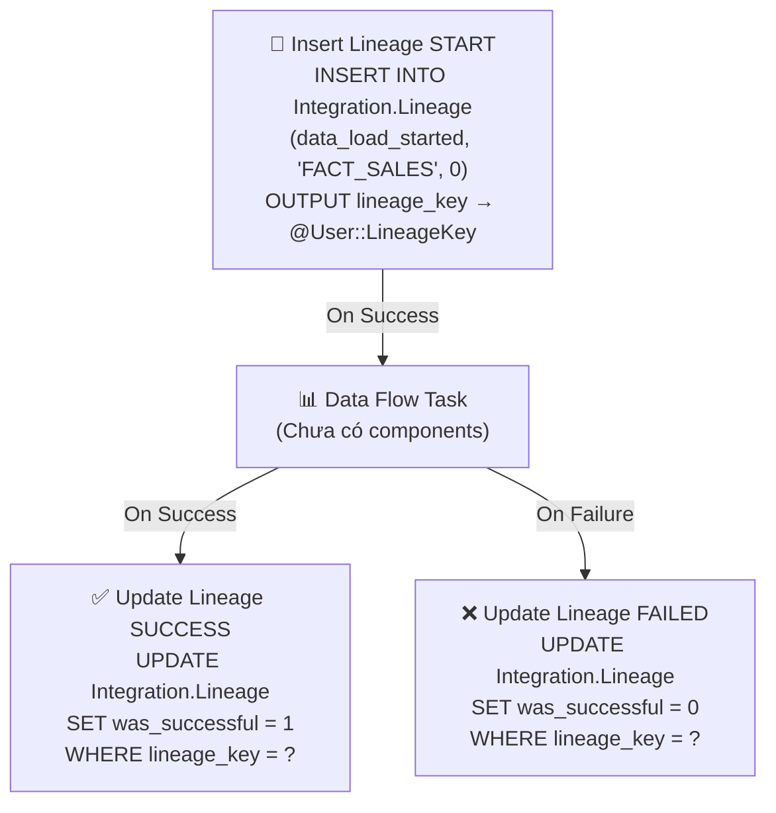
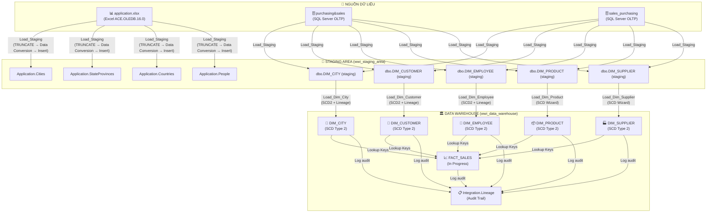

# BÁO CÁO LUỒNG ĐỔ DỮ LIỆU (ETL DATA FLOW)
## Project: WideWorldImposter — SSIS Integration Services

> **Ngày lập báo cáo:** 08/05/2026  
> **Công cụ:** SQL Server Integration Services (SSIS) — Visual Studio 17.0.1016.0  
> **Môi trường:** localhost (SQL Server)

---

## 1. TỔNG QUAN KIẾN TRÚC

Project WideWorldImposter xây dựng một hệ thống **Data Warehouse (DW)** theo mô hình **ETL ba tầng**:

```
[Nguồn dữ liệu]  →  [Staging Area]  →  [Data Warehouse]
  (Excel / OLTP)       (wwi_staging_area)   (wwi_data_warehouse)
```

| Tầng | Database | Vai trò |
|------|----------|---------|
| Nguồn | `purchasing&sales`, `sales_purchasing`, file Excel `.xlsx`, PostgreSQL | Dữ liệu giao dịch thô |
| Staging | `wwi_staging_area` | Vùng trung gian — làm sạch và chuẩn hóa |
| Data Warehouse | `wwi_data_warehouse`, `financial_data_warehouse` | Kho dữ liệu phân tích cuối cùng |

---

## 2. DANH SÁCH PACKAGE ETL

| Package | File | Chức năng | Kích thước |
|---------|------|-----------|-----------|
| **Master_ETL** | `Master_ETL.dtsx` | Package điều phối — gọi tuần tự các package con | 13 KB |
| **Load_Staging** | `Load_Staging.dtsx` | Nạp dữ liệu từ Excel/OLTP/PostgreSQL vào Staging | 983 KB |
| **Load_Dim_City** | `Load_Dim_City.dtsx` | Tải bảng chiều DIM_CITY (SCD Type 2) | 141 KB |
| **Load_Dim_Customer** | `Load_Dim_Customer.dtsx` | Tải bảng chiều DIM_CUSTOMER (SCD Type 2) | 128 KB |
| **Load_Dim_Employee** | `Load_Dim_Employee.dtsx` | Tải bảng chiều DIM_EMPLOYEE (SCD Type 2) | 113 KB |
| **Load_Dim_Product** | `Load_Dim_Product.dtsx` | Tải bảng chiều DIM_PRODUCT (SCD Type 2) | 127 KB |
| **Load_Dim_Supplier** | `Load_Dim_Supplier.dtsx` | Tải bảng chiều DIM_SUPPLIER (SCD Type 2) | 103 KB |
| **Load_Fact_Sale** | `Load_Fact_Sale.dtsx` | Tải bảng sự kiện FACT_SALES | 12 KB |
| **Load_Fact_Purchase** | `Load_Fact_Purchase.dtsx` | Tải bảng sự kiện FACT_PURCHASE | - |
| **Load_Fact_Inventory** | `Load_Fact_Inventory.dtsx` | Tải bảng sự kiện FACT_INVENTORY | - |
| **Load_Agg_Fact** | `Load_Agg_Fact.dtsx` | Tạo các bảng tổng hợp AGG_* | - |

---

## 3. LUỒNG ĐIỀU PHỐI — PACKAGE MASTER_ETL

Package `Master_ETL.dtsx` đóng vai trò **orchestrator**, thực thi các package con theo thứ tự tuần tự (Precedence Constraint):



> [!IMPORTANT]
> **Thứ tự thực thi đảm bảo tính toàn vẹn dữ liệu:** Staging trước, Dimensions theo thứ tự phụ thuộc, Facts sau cùng, Aggregations cuối cùng.

---

## 4. PACKAGE LOAD_STAGING — NẠP DỮ LIỆU VÀO STAGING

### 4.1 Nguồn dữ liệu & Kết nối

| Connection Manager | Loại | Database/File | Vai trò |
|--------------------|------|--------------|---------|
| Excel Connection Manager | EXCEL (ACE.OLEDB.16.0) | `D:\ssms2postgre\file backup\application.xlsx` | File Excel nguồn gốc |
| localhost.purchasing&sales | OLEDB (SQLOLEDB) | `purchasing&sales` | DB giao dịch mua bán |
| localhost.sales_purchasing | OLEDB (SQLOLEDB) | `sales_purchasing` | DB giao dịch (biến thể) |
| localhost.wwi_staging_area | OLEDB (SQLOLEDB) | `wwi_staging_area` | Đích: Staging Area |
| localhost.wwi_data_warehouse | OLEDB (SQLOLEDB) | `wwi_data_warehouse` | Đích: Data Warehouse |
| postgres_ssis | ODBC | PostgreSQL | Kết nối PostgreSQL |

### 4.2 Cấu trúc nội bộ Load_Staging

Package nạp dữ liệu từ:
- Excel worksheets (Application.Cities, StateProvinces, Countries, People)
- SQL Server OLTP databases (Purchasing.Suppliers, Sales.Customers, etc.)
- PostgreSQL (warehouse.stockitemholdings, colors, etc.)

**Các bảng được nạp vào Staging:**
- Application.Cities, StateProvinces, Countries, People
- Purchasing.Suppliers, SupplierCategories
- Sales.Customers, BuyingGroups, CustomerCategories
- Warehouse.StockItems, Colors, PackageTypes
- Purchasing.PurchaseOrders, PurchaseOrderLines
- Sales.Invoices, InvoiceLines, Orders
- Warehouse.StockItemTransactions, StockItemHoldings
- Và các bảng từ PostgreSQL

---

## 5. CÁC PACKAGE DIMENSION (SCD TYPE 2)

Tất cả 5 package Dimension đều implement **Slowly Changing Dimension Type 2** với pattern thống nhất:

### 5.1 Pattern chung cho Dimension Packages



### 5.2 Load_Dim_City
- **Nguồn:** Application.Cities, StateProvinces, Countries
- **Đích:** DIM_CITY (wwi_data_warehouse)
- **SCD Logic:** Expire bản ghi cũ, insert bản ghi mới với valid_from/valid_to

### 5.3 Load_Dim_Customer
- **Nguồn:** Sales.Customers, BuyingGroups, CustomerCategories, Application.People
- **Đích:** DIM_CUSTOMER
- **Business Key:** wwi_customer_id

### 5.4 Load_Dim_Employee
- **Nguồn:** Application.People
- **Đích:** DIM_EMPLOYEE
- **Business Key:** wwi_employee_id

### 5.5 Load_Dim_Product
- **Nguồn:** Warehouse.StockItems, Colors, PackageTypes
- **Đích:** DIM_PRODUCT
- **Business Key:** wwi_stock_item_id

### 5.6 Load_Dim_Supplier
- **Nguồn:** Purchasing.Suppliers, SupplierCategories
- **Đích:** DIM_SUPPLIER (có thêm connection đến financial_data_warehouse)
- **Business Key:** wwi_supplier_id
- **SCD Commands:**
  - Expire: `UPDATE DIM_SUPPLIER SET valid_to = ? WHERE wwi_supplier_id = ? AND valid_to IS NULL`
  - Update: `UPDATE DIM_SUPPLIER SET payment_days = ?, supplier_category = ?, supplier_name = ? WHERE wwi_supplier_id = ?`

---

## 6. CÁC PACKAGE FACT

### 6.1 Load_Fact_Sale
- **Nguồn:** Sales.InvoiceLines, Invoices, Customers, Orders
- **Lookups:** DIM_CITY, DIM_CUSTOMER, DIM_DATE, DIM_EMPLOYEE, DIM_PRODUCT
- **Đích:** FACT_SALES
- **Tiền xử lý:** Tính toán các metrics bán hàng

### 6.2 Load_Fact_Purchase
- **Nguồn:** Purchasing.PurchaseOrders, PurchaseOrderLines, Warehouse.StockItems
- **Lookups:** DIM_PRODUCT, DIM_SUPPLIER
- **Đích:** FACT_PURCHASE

### 6.3 Load_Fact_Inventory
- **Nguồn:** Warehouse.StockItemTransactions, StockItemHoldings
- **Tiền xử lý:** Derived Column tạo date_key, lineage_key
- **Lookups:** DIM_DATE, DIM_PRODUCT
- **Đích:** FACT_INVENTORY

---

## 7. PACKAGE LOAD_AGG_FACT — TỔNG HỢP DỮ LIỆU

Package chạy 3 Execute SQL Tasks để tạo bảng tổng hợp:

### 7.1 AGG_INVENTORY_WEEKLY
```sql
INSERT INTO AGG_INVENTORY_WEEKLY
SELECT year_number, week_of_year, product_key,
       SUM(total_qty_in) as total_qty_in,
       SUM(total_qty_out) as total_qty_out,
       SUM(net_change) as net_change,
       COUNT(*) as count_transactions
FROM FACT_INVENTORY
GROUP BY year_number, week_of_year, product_key
```

### 7.2 AGG_SALES_DAILY
```sql
INSERT INTO AGG_SALES_DAILY
SELECT date_key,
       SUM(quantity) as total_quantity,
       SUM(tax_amount) as total_tax,
       SUM(total_including_tax) as total_revenue,
       SUM(line_profit) as total_profit,
       AVG(total_including_tax) as avg_order_value,
       COUNT(DISTINCT invoice_id) as count_invoices,
       COUNT(DISTINCT product_key) as count_distinct_products
FROM FACT_SALES
GROUP BY date_key
```

### 7.3 AGG_SALES_PRODUCT_CITY_DAILY
```sql
INSERT INTO AGG_SALES_PRODUCT_CITY_DAILY
SELECT date_key, product_key, city_key,
       SUM(quantity) as total_quantity,
       SUM(total_including_tax) as total_revenue,
       SUM(line_profit) as total_profit
FROM FACT_SALES
GROUP BY date_key, product_key, city_key
```

---

## 8. CƠ CHẾ THEO DÕI LINEAGE (AUDIT TRAIL)

Mỗi package đều có cơ chế tracking:
- **Insert Lineage START:** Ghi log bắt đầu load
- **Update Lineage SUCCESS/FAILED:** Ghi kết quả load
- **Lineage Key:** ID duy nhất cho mỗi lần load

---

## 9. SƠ ĐỒ LUỒNG DỮ LIỆU TỔNG THỂ



---

## 10. PHÂN TÍCH KỸ THUẬT

### 10.1 Kỹ thuật SCD Type 2
- **Phát hiện thay đổi:** Component Slowly Changing Dimension
- **Lưu lịch sử:** Insert bản ghi mới khi thay đổi
- **Surrogate Key:** IDENTITY columns
- **Business Key:** Natural keys từ nguồn

### 10.2 Connection Managers
- **OLE DB:** Cho SQL Server (Integrated Security)
- **Excel:** ACE.OLEDB.16.0 driver
- **ODBC:** Cho PostgreSQL (DSN: postgres_ssis)

### 10.3 Variables & Parameters
- **User::CurrentDate:** GETDATE() cho SCD
- **User::LineageKey:** Tracking load sessions
- **Project.params:** Trống (không dùng parameterization)

---

## 11. TÓM TẮT THỐNG KÊ

| Chỉ tiêu | Giá trị |
|---------|---------|
| Tổng số package | 11 (1 Master + 10 Child) |
| Số bảng Dimension | 5 |
| Số bảng Fact | 3 |
| Số bảng Aggregation | 3 |
| Kỹ thuật SCD | Type 2 |
| Nguồn dữ liệu | Excel + SQL Server + PostgreSQL |
| Cơ chế audit | Integration.Lineage |
| Connection types | OLE DB, ODBC, Excel |
| Phiên bản SSIS | 17.0.1016.0 |

---

## 12. HƯỚNG DẪN TRIỂN KHAI

1. **Cài đặt prerequisites:**
   - SQL Server với SSIS
   - Microsoft Access Database Engine 2016
   - PostgreSQL ODBC driver

2. **Tạo databases:**
   - wwi_staging_area
   - wwi_data_warehouse
   - financial_data_warehouse

3. **Cấu hình connections:**
   - Excel file path
   - DSN postgres_ssis
   - SQL Server instances

4. **Chạy theo thứ tự:**
   - Load_Staging
   - Load_Dim_* (theo thứ tự trong Master)
   - Load_Fact_*
   - Load_Agg_Fact

---

*Báo cáo được cập nhật dựa trên phân tích chi tiết các file .dtsx trong project WideWorldImposter.*
| 3 | **OLE DB Destination** | Ghi vào `[Application].[Cities]` trong `wwi_staging_area` |

**Cột được nạp vào Staging:**
- `CityID` (int), `CityName` (nvarchar 255), `StateProvinceID` (int)
- `Location` (nvarchar 255), `LatestRecordedPopulation` (int)

---

## 5. PACKAGE LOAD_DIM_CITY — XÂY DỰNG BẢNG CHIỀU THÀNH PHỐ

### 5.1 Kết nối

| Connection | Database |
|-----------|----------|
| Source | `wwi_staging_area` → `[dbo].[DIM_CITY]` (đọc dữ liệu hiện có trong DW) |
| Destination | `wwi_data_warehouse` → `[dbo].[DIM_CITY]` |

### 5.2 Biến (Variables)

| Biến | Kiểu | Giá trị | Mục đích |
|------|------|---------|---------|
| `User::CurrentDate` | DateTime | `GETDATE()` | Timestamp cho SCD |
| `User::LineageKey` | Int32 | 0 (dynamic) | Khóa tracking lineage |

### 5.3 Luồng xử lý SCD Type 2



### 5.4 Câu SQL quan trọng

```sql
-- Hết hiệu lực bản ghi cũ (SCD Type 2):
UPDATE [dbo].[DIM_CITY]
SET [valid_to] = ?
WHERE [wwi_city_id] = ? AND [valid_to] IS NULL

-- Cập nhật thông tin thực tế:
UPDATE [dbo].[DIM_CITY]
SET [city_name] = ?, [continent] = ?, [country] = ?,
    [latest_recorded_population] = ?, [region] = ?,
    [sales_territory] = ?, [state_province] = ?, [subregion] = ?
WHERE [wwi_city_id] = ?

-- Đánh dấu hết hiệu lực:
UPDATE DIM_CITY SET is_current = 0
WHERE valid_to IS NOT NULL AND is_current = 1
```

### 5.5 Cột đích trong DIM_CITY

| Cột | Kiểu | Ghi chú |
|-----|------|---------|
| city_key | int (IDENTITY) | Surrogate Key |
| wwi_city_id | int | Business Key từ nguồn |
| city_name | nvarchar(255) | |
| state_province | nvarchar(255) | |
| country | nvarchar(60) | |
| continent | nvarchar(30) | |
| sales_territory | nvarchar(255) | |
| region | nvarchar(30) | |
| subregion | nvarchar(30) | |
| latest_recorded_population | int | |
| valid_from | datetime | SCD Type 2 |
| valid_to | datetime | SCD Type 2 (NULL = hiện tại) |
| is_current | int | 1 = đang hiệu lực |
| lineage_key | int | Tracking load |

---

## 6. PACKAGE LOAD_DIM_CUSTOMER — BẢNG CHIỀU KHÁCH HÀNG

### 6.1 Luồng tương tự SCD Type 2

Cấu trúc tương tự `Load_Dim_City` với các bước:

1. **OLE DB Source**: Đọc từ `wwi_staging_area.[DIM_CUSTOMER]`
2. **Slowly Changing Dimension**: Phát hiện New / Changed
3. **Derived Column** (valid_to, valid_from, lineage_key)
4. **OLE DB Command**: Expire bản ghi cũ
5. **Insert Destination**: Ghi vào `wwi_data_warehouse.[dbo].[DIM_CUSTOMER]`

### 6.2 Câu SQL cập nhật

```sql
UPDATE [dbo].[DIM_CUSTOMER]
SET [valid_to] = ?
WHERE [wwi_customer_id] = ? AND [valid_to] IS NULL

UPDATE [dbo].[DIM_CUSTOMER]
SET [bill_to_customer] = ?, [buying_group] = ?,
    [customer_category] = ?, [customer_name] = ?,
    [postal_code] = ?, [primary_contact] = ?
WHERE [wwi_customer_id] = ?
```

### 6.3 Cột đích trong DIM_CUSTOMER

| Cột | Kiểu |
|-----|------|
| customer_key | int (IDENTITY) |
| wwi_customer_id | int |
| customer_name | nvarchar(255) |
| bill_to_customer | nvarchar(255) |
| customer_category | nvarchar(255) |
| buying_group | nvarchar(255) |
| primary_contact | nvarchar(255) |
| postal_code | nvarchar(255) |
| valid_from / valid_to / is_current / lineage_key | SCD cols |

---

## 7. PACKAGE LOAD_DIM_EMPLOYEE — BẢNG CHIỀU NHÂN VIÊN

### 7.1 Luồng xử lý

Nguồn: `wwi_staging_area.[DIM_EMPLOYEE]`  
Đích: `wwi_data_warehouse.[dbo].[DIM_EMPLOYEE]`

```sql
-- Query đọc từ staging:
SELECT [employee_name], [is_salesperson], [preferred_name],
       [wwi_employee_id], [valid_from], [valid_to]
FROM [dbo].[DIM_EMPLOYEE]

-- Cập nhật thông tin:
UPDATE [dbo].[DIM_EMPLOYEE]
SET [employee_name] = ?, [is_salesperson] = ?, [preferred_name] = ?
WHERE [wwi_employee_id] = ?

-- Hết hiệu lực:
UPDATE [dbo].[DIM_EMPLOYEE]
SET [valid_to] = ?
WHERE [wwi_employee_id] = ? AND [valid_to] IS NULL
```

---

## 8. PACKAGE LOAD_DIM_PRODUCT — BẢNG CHIỀU SẢN PHẨM

### 8.1 Đặc điểm nổi bật

Package này sử dụng component **Slowly Changing Dimension** (wizard-based) với các output:

| Output | Ý nghĩa | Xử lý tiếp theo |
|--------|---------|----------------|
| New Output | Bản ghi hoàn toàn mới | Union All → Insert Destination |
| Historical Attribute Inserts | Thuộc tính thay đổi (SCD2) | Derived Column → OLE DB Command (expire) |
| Inferred Member Updates | Cập nhật thành viên suy luận | OLE DB Command 1 |

### 8.2 Nguồn dữ liệu

Component nguồn: `staging_area_warehouse` (OLE DB Source từ `wwi_staging_area`)

### 8.3 Cột đích DIM_PRODUCT (trích)

- `wwi_stock_item_id`, `stock_item_name`, `color`, `selling_package`
- `buying_package`, `brand`, `size`, `leading_supplier_id`
- `package_type`, `is_chiller_stock`
- `valid_from`, `valid_to`, `is_current`, `lineage_key`

---

## 9. PACKAGE LOAD_DIM_SUPPLIER — BẢNG CHIỀU NHÀ CUNG CẤP

### 9.1 Cấu trúc

Tương tự `Load_Dim_Product` với SCD wizard, source từ `staging_area_warehouse`.

**Các component trong Data Flow:**
- `staging_area_warehouse` (OLE DB Source)
- `Slowly Changing Dimension`
- `Union All 1`, `Derived Column 2`, `Derived Column 3`
- `OLE DB Command 2` (expire cũ), `OLE DB Command 3` (inferred updates)
- `Insert Destination 1` → `wwi_data_warehouse.[dbo].[DIM_SUPPLIER]`

### 9.2 Cột đích DIM_SUPPLIER (trích)

- `wwi_supplier_id`, `supplier_name`, `supplier_category`
- `payment_days`, `valid_from`, `valid_to`, `is_current`, `lineage_key`

---

## 10. PACKAGE LOAD_FACT_SALE — BẢNG SỰ KIỆN BÁN HÀNG

### 10.1 Cấu trúc đặc biệt

Package này hiện có cấu trúc **khung (skeleton)** — Data Flow Task chưa có components, nhưng đã có đầy đủ cơ chế tracking lineage:



---

## 11. CƠ CHẾ THEO DÕI LINEAGE (TRACKING)

Mỗi Dimension package đều có quy trình theo dõi quá trình tải:

| Bước | Task | SQL |
|------|------|-----|
| 1 | Insert Lineage START | `INSERT INTO Integration.Lineage (data_load_started, table_name, was_successful) VALUES (SYSDATETIME(), 'DIM_XXX', 0) → lineage_key` |
| 2 | Data Flow / Transformation | Quá trình ETL chính |
| 3a | Update is_current | `UPDATE DIM_XXX SET is_current = 0 WHERE valid_to IS NOT NULL AND is_current = 1` |
| 3b | Update Lineage SUCCESS | `UPDATE Integration.Lineage SET data_load_completed = SYSDATETIME(), was_successful = 1 WHERE lineage_key = ?` |
| 3c | Update Lineage FAILED | `UPDATE Integration.Lineage SET data_load_completed = SYSDATETIME(), was_successful = 0 WHERE lineage_key = ?` |

---

## 12. SƠ ĐỒ LUỒNG DỮ LIỆU TỔNG THỂ



---

## 13. PHÂN TÍCH KỸ THUẬT & NHẬN XÉT

### 13.1 Kỹ thuật SCD Type 2 được áp dụng

Tất cả các bảng Dimension đều implement **Slowly Changing Dimension Type 2**:
- **Phát hiện thay đổi:** Dùng component `Slowly Changing Dimension` của SSIS
- **Lưu lịch sử:** Thêm bản ghi mới khi thuộc tính thay đổi
- **Đánh dấu hiệu lực:** Cột `valid_from`, `valid_to`, `is_current`
- **Surrogate Key:** Mỗi bảng có khóa thay thế riêng (city_key, customer_key, v.v.)

### 13.2 Pattern xử lý nhất quán

Mỗi Dimension package tuân theo pattern 5 bước chuẩn:

```
1. Insert Lineage START (ghi log bắt đầu)
2. OLE DB Source (đọc staging)
3. SCD Transform (phân loại New/Changed/Unchanged)
4. Apply Changes (expire cũ + insert mới)
5. Update Lineage SUCCESS/FAILED (ghi log kết quả)
```

### 13.3 Điểm cần lưu ý

> [!WARNING]
> **Load_Fact_Sale** hiện chưa hoàn chỉnh — Data Flow Task không có component nào. Bảng FACT_SALES chưa được nạp dữ liệu thực tế.

> [!NOTE]
> Connection Manager cho Excel dùng driver **Microsoft.ACE.OLEDB.16.0** — cần cài đặt Microsoft Access Database Engine 2016 trên máy chủ SSIS.

> [!TIP]
> Thứ tự thực thi trong Master_ETL đảm bảo tính toàn vẹn referential: Staging → Product → Supplier → Customer → Employee → City, tránh lỗi foreign key.

---

## 14. TÓM TẮT THỐNG KÊ

| Chỉ tiêu | Giá trị |
|---------|---------|
| Tổng số package | 8 |
| Số bảng Dimension | 5 (City, Customer, Employee, Product, Supplier) |
| Số bảng Fact | 1 (FACT_SALES — chưa hoàn chỉnh) |
| Kỹ thuật SCD | Type 2 (lưu toàn bộ lịch sử) |
| Nguồn dữ liệu | Excel (ACE OLEDB) + SQL Server OLTP |
| Cơ chế audit | Integration.Lineage table |
| Ngôn ngữ | SSIS (XML/DTSX), T-SQL |
| Phiên bản SSIS | 17.0.1016.0 (SQL Server 2025) |
